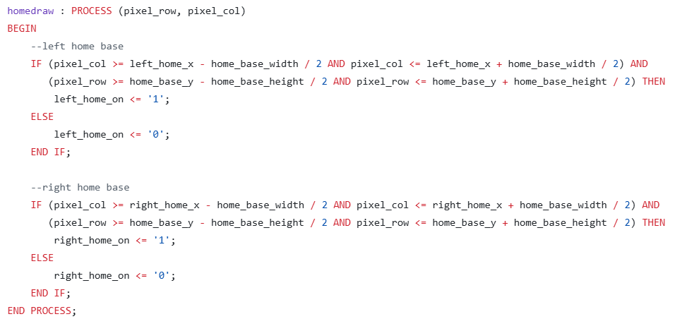
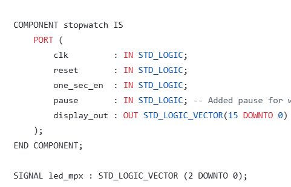
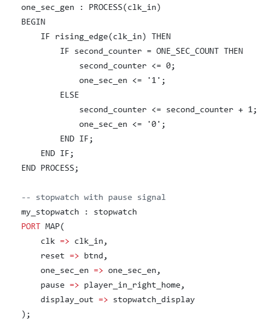
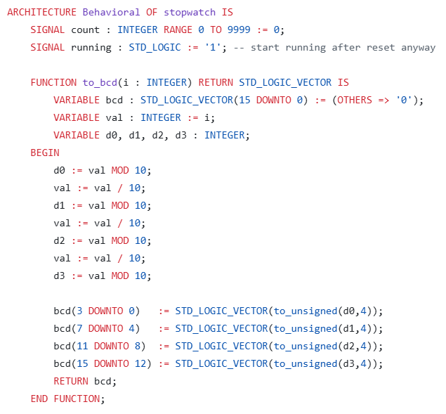
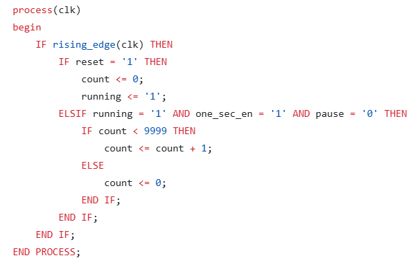

# WorldsHardestGame

This project uses a VGA connector to display a game with a user-controlled square that needs to navigate to the safe zone on the other side without hitting the moving circles. Each circle alternates in the direction that it is moving, The buttons [buttons] are used to control the square up down left, and right. If the square hits any circle it moves back to the starting position. There is a stopwatch that counts up once the reset button is hit. Once it reaches the other safe zone on the other side, the stopwatch stops counting up. 

Inspiration for our game was taken from "World's Hardest Game" as shown below

# Vivado and Nexys A7 Implementation
## The most optimal and recommended speed is when the J15 and L16 switches are flipped when running
We used the Pong Lab 6 code as the starter code.
1. We had to use a VGA connector to display our code on the screen. 
2. We repurposed the bat to be a square rather than a rectangle and gave it x and y motion rather than just x motion
3. We added two safe zones on both sides of the screen, one to spawn in and the other to signify victory once the player has entered it. 
4. We took away the x motion of the ball so that it continuously moves up and down. Then we proceeded to duplicate the balls so that there were 6 moving in the same direction.
5. Then we added 6 more balls moving in opposite directions of the initial 6 balls
6. We decided to keep to the speed logic from the switches as a way to change the difficulty of the game.
7. We added a stopwatch to keep track of how long the game has been playing for and it stops when the player wins

### Inputs and Outputs
#### player_n_ball
        player_x : IN STD_LOGIC_VECTOR (10 DOWNTO 0); - Represents the horizontal position of the player. Controlled by the buttons connected to the Nexys board.
        player_y : IN STD_LOGIC_VECTOR (10 DOWNTO 0); - Represents the vertical position of the player. Controlled by the buttons connected to the Nexys board.
        reset : IN STD_LOGIC; - Connected to a reset button on the Nexys board. Put the game to its default state by resetting the ball positions, clearing the hit_count, and stopping any active game motion.
        hit_count : OUT STD_LOGIC_VECTOR(15 DOWNTO 0); - Keeps track of the failed attempts/collisions. Will be displayed on the annodes.
        SW : IN STD_LOGIC_VECTOR (4 DOWNTO 0) - Maps directly to the switches on the board. allows for the adjustment of the speed of the balls during the game.
#### pong
        btnu : IN STD_LOGIC; - Represents the up button on the board. Moves the player up
        btnd : IN STD_LOGIC; - The down button on the board. Serves as the reset so when its pressed it resets the game to its initial configuration
        btn0 : IN STD_LOGIC; -  Moves the player down
        SW : IN STD_LOGIC_VECTOR (4 DOWNTO 0) - Allows for the adjustment of the speed of the balls during the game.
#### stopwatch
        clk         : IN STD_LOGIC; - Primary clock signal; ensures the timing of all processes.      
        reset       : IN STD_LOGIC; - Puts the stopwatch to the default state
        one_sec_en  : IN STD_LOGIC; - Enable signal to increment its count once per second
        pause       : IN STD_LOGIC; - freezing the current count on the stopwatch
        display_out : OUT STD_LOGIC_VECTOR(15 DOWNTO 0) - output can be 0 to 9999, shows the current count of the stopwatch in BCD format

        

### Modifications
#### Multiple balls

Multiple balls were added to the screen, other than just 1 in the pong game. Each one was set to start halfway up the screen and was aligned 100 pixels apart. Then another 6 balls were added going in the opposite direction, also 100 pixels apart. A total of 12 balls were added, each ball alternates in its direction. the bdraw process checks for the pixel in the bounds and displays the balls

Demonstration:

https://github.com/user-attachments/assets/37c69e4a-f1b2-4651-b5a3-8b9f8e63c7d5

#### Player Movement

Convert the player’s current position into integers, adjust it according to button inputs; Keep the player in bounds
Check for overlaps with blocked areas by evaluating logical conditions; No overlaps -> update player position 
The player's current position -> player_x and player_y. if the left button is pressed and the count condition equals zero, the player's horizontal position moves left. Same with the right. If new_x is less than 20 or greater than 780, and setting it to 20 or 780 keeps the player in bounds. Same check for if the player tries to go in any area that its not allowed to.

#### Safe areas

Defines constants and signals. left_home_x constant calculates the horizontal center of the left base as half the width. right_home_x positions the right base near the screen's far-right edge, calculated as 800 minus half the width. home_base_y (300), is the vertical center used by both bases. left_home_on and right_home_on displays the bases.
Homedraw renders the safe base on the screen. Sees if a pixel overlaps with the home base areas. Compares the current pixel's row and column to the rectangle boundaries. If the pixel is within the bounds, signals left_home_on, right_home_on are set to 1, otherwise 0.

Demonstration:

https://github.com/user-attachments/assets/c55fcb5f-eee2-46a3-bdd8-87d57fd0113c

#### Collision Detection

Computes vx and vy to determine if a pixel is within the circular area of a ball; Series of conditional checks to detect if any ball overlaps with the player’s area
The checks validate whether any part of the ball’s box intersects the player’s position. If at least one ball overlaps with the player the hit_detected flag is updated. A local hit count is incremented. If no overlap occurs, hit_detected is reset. Only one hit at a time.

##### Stopwatch

Counts up in seconds and outputs the time passed. The output display_out gives the current count in Binary-coded-decimal format. The architecture contains an integer signal count to store the current count, ranging from 0 to 9999, and a running signal to track whether the stopwatch is active. The to_bcd function converts the integer count into a 16-bit BCD format by extracting each decimal digit and assigning it to a 4-bit segment of the BCD vector. On every rising edge of the clock, If reset is 1, the counter resets to zero, and the stopwatch starts running. If the stopwatch is running the one_sec_en signal is 1 and pause is 0, the counter increments by 1. If the counter reaches 9999 it wraps back to zero. If pause is active the stopwatch does not increment. The current count is continuously converted to BCD format using the to_bcd function and assigned to the output signal display_out. Process one_sec_gen counts clock cycles using second_counter, resetting it to 0 and setting one_sec_en to 1 whenever the count reaches ONE_SEC_COUNT, which is one second. The my_stopwatch instance of the stopwatch entity connects to this generated one_sec_en signal to ensure the stopwatch increments only once per second. btnd acts as the reset input, and player_in_right_home acts as the pause signal, allowing the stopwatch to stop after winning the game.

Demonstration:

https://youtu.be/o3DLZq5Zxs8
   
### Conclusion
Started the project on Tuesday, and decided to make a version of "World's Hardest Game"; On Wednesday started the initial changing of existing components; By Thursday  we had all 12 balls on screen and everything was appearing as it should; Friday collision logic was finished. Saturday the timer was implemented.

There was an issue trying to make both sets of balls bounce on the walls at the same time. Sometimes they would bounce at different times causing both sets of balls to move in the same direction which would cause the game to be unplayable. We initially tried changing the starting location, but after that didn't work we realized that the starting locations of the balls were constantly being overridden in the temp sections of the code. They were all initially 440 from the pong lab and we needed the balls to start at 300 for the purposes of our project. The collision detection works, but there are some instances where the ball visually touches the squares on the sides and the corners and it doesn't register.

John Shea - Wrote parts of the code, responsible for the GitHub README.md, worked on slides

Joris Wilson - Wrote parts of the code, Held onto the Nexys board and was responsible for running the code, worked on slides

Final Demo Demonstration:

https://youtu.be/nG2WWNcUR1o
